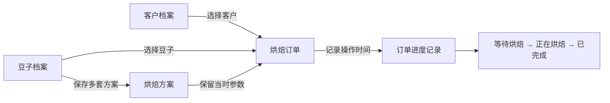

# 企鹅烘焙：第一版怎么用

这一版先把订单从创建到完成记清楚，不记录库存。

## 第一次使用

1. 打开“客户档案”，添加客户名称。联系人、联系方式和偏好可以选填。
2. 打开“豆子档案”，添加豆子的名字、产地等信息。
3. 在豆子卡片上点击“管理方案”，保存自己的烘焙曲线关键点。时间写成“分:秒”，例如 1:30；豆温单位为 ℃，火力和风门单位为 %。
4. 回到“烘焙订单”，新建订单，选择客户、豆子和方案，填写订购熟豆重量。
5. 查看订单，点击“开始烘焙”。烘焙并完成交付后，点击“标记完成 / 已交付”。
6. 在“已完成订单”中回看这张订单和当时使用的方案。

## 这一版的规则

- 一张订单对应一位客户、一款豆子和一套烘焙方案。
- 订单有三个状态：等待烘焙、正在烘焙、已完成。
- “已完成”就表示这一版的交付完成，不单独记录物流。
- 订购数量是交给客户的熟豆重量；方案投豆量是该方案每锅投入的生豆重量。这两个数字不混用。
- 烘焙方案的曲线是手动录入的目标参数，不连接烘焙机，不采集实际曲线，也不控制设备。
- 订单创建时会保留客户名称、豆子名称和烘焙方案快照；以后修改档案，不会改掉旧订单。
- 数据保存于网页自己的数据库，不依赖浏览器缓存。GitHub 保存的是软件代码，不保存客户和订单数据。
- 本地预览与正式网页各用独立数据，测试记录不会自动进入正式网页。
- 暂不提供删除订单、回退已完成状态、多用户协作、库存、账务或物流功能。

## 记录之间的关系

